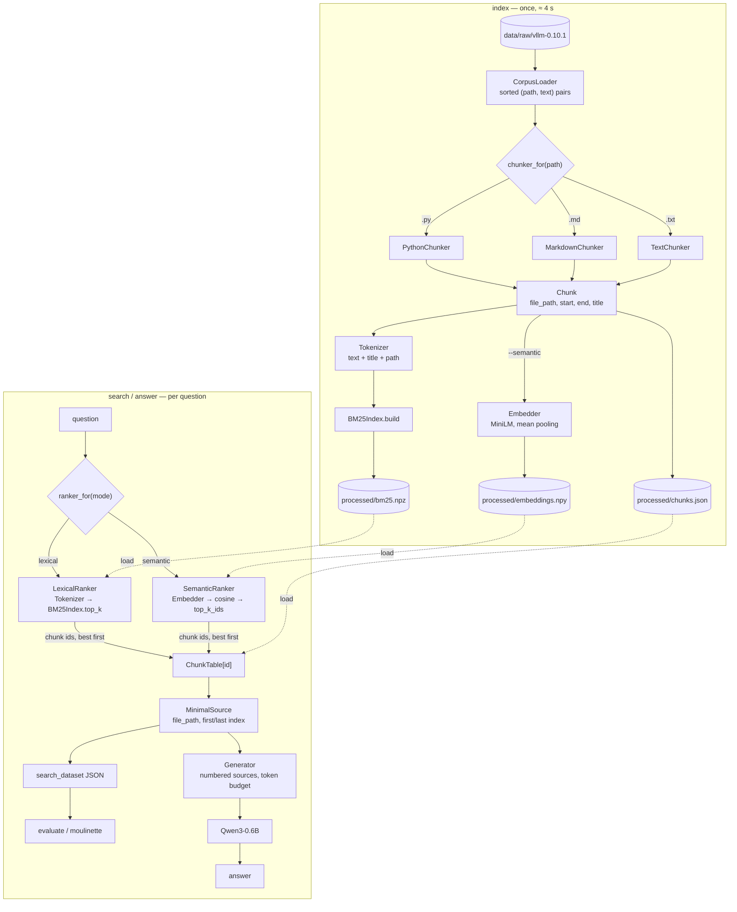

*This project has been created as part of the 42 curriculum by vlnikola*.

# RAG against the machine

A question-answering system over the source code and documentation of
[vLLM 0.10.1](https://github.com/vllm-project/vllm). Ask "What HTTP endpoint
loads a LoRA adapter?" and it finds the exact place in the repository
(`docs/features/lora.md`, characters 4695–6100) and has a small local language
model answer from that text: *"`/v1/load_lora_adapter` [1]"*.

Everything that decides *where* to look — chunking, tokenizing, ranking — is
written by hand with the standard library and numpy. No search library, no
vector database.

## Table of contents

1. [Description](#description)
2. [Instructions](#instructions)
3. [Example usage](#example-usage)
4. [System architecture](#system-architecture)
5. [Chunking strategy](#chunking-strategy)
6. [Retrieval method](#retrieval-method)
7. [Answer generation](#answer-generation)
8. [Performance analysis](#performance-analysis)
9. [Design decisions](#design-decisions)
10. [Challenges faced](#challenges-faced)
11. [Development history](#development-history)
12. [Resources](#resources)

---

## Description

### RAG in one minute

A language model only knows what it saw during training. It has never read
*your* codebase, and retraining it every time the code changes is far too
expensive. **Retrieval-Augmented Generation (RAG)** works around that: at
question time, *search* your own data for the few passages that answer the
question, paste them into the prompt, and let the model answer from them —
like an open-book exam.

A RAG system has four stages:

| Stage | What happens | Analogy |
|---|---|---|
| **Indexing** | Split every file into small pieces (*chunks*) and build a search structure over them. Done once. | Writing the index at the back of a book |
| **Retrieval** | Turn the question into search terms and find the best-matching chunks. | Looking words up in that index |
| **Augmentation** | Put the retrieved chunks into the model's prompt. | Opening the book at those pages |
| **Generation** | The model writes an answer using only that text. | Answering with the book open |

Two terms used throughout this README:

- **Recall@k** — for each question, did the correct passage appear among the
  top *k* results? Averaged over all questions. "Recall@5 = 0.87" means the
  right place was in the first 5 results for 87% of questions.
- **Precision** is its counterpart: how many of the returned results are
  relevant. Example: the answer lives in 1 place and we return 5 chunks, one
  of them right → recall = 1/1 = 100%, precision = 1/5 = 20%. For RAG,
  **recall matters more**: a model can ignore 4 irrelevant chunks, but it
  cannot answer from a chunk that was never retrieved.

A retrieved passage counts as correct when it is in the **same file** as the
reference and overlaps it with **IoU ≥ 0.05**. IoU (intersection over union)
compares two character ranges:

```
reference:     [==========]          100 → 200
retrieved:          [==========]     150 → 250
intersection:       [=====]          150 → 200   50 chars
union:         [===============]     100 → 250   150 chars   → IoU = 50/150 = 0.33
```

IoU also penalizes passages that are much *larger* than the reference: a
2000-character chunk that fully contains a 60-character answer has
IoU = 0.03 and does **not** count. Returning whole files is not a shortcut.

### What this project builds

- **Corpus:** the vLLM repository — 1,969 `.py`, `.md` and `.txt` files.
- **Questions:** two public datasets of ~100 questions each: *docs*
  questions (answers in Markdown documentation) and *code* questions
  (answers in Python source).
- **Goal:** recall@5 ≥ 80% on docs and ≥ 50% on code, indexing in under
  5 minutes, retrieval for 200 questions in under 90 seconds, then grounded
  answers from `Qwen/Qwen3-0.6B` running on CPU.
- **Result:** recall@5 = **0.87** (docs) and **0.88** (code); indexing ≈ 4 s;
  100 questions searched in ≈ 0.3 s.

---

## Instructions

**Requirements:** Python ≥ 3.10, [uv](https://docs.astral.sh/uv/), ~1 GB of
disk for dependencies (CPU-only PyTorch) and ~1.5 GB for the model weights,
downloaded from Hugging Face on first use.

```bash
make install        # uv sync — installs everything, incl. CPU-only torch
```

Expected data layout (not committed to git):

```
data/
├── raw/vllm-0.10.1/                       the corpus to index
├── datasets/
│   ├── UnansweredQuestions/*.json         questions only
│   └── AnsweredQuestions/*.json           questions + reference sources
├── processed/                             written by `index`
└── output/                                written by search_dataset / answer_dataset
```

Every command is `uv run python -m src <command> [options]`:

| Command | What it does |
|---|---|
| `index [--max_chunk_size 2000] [--semantic]` | Chunk and index `data/raw/` into `data/processed/`; `--semantic` also embeds every chunk (bonus, see [Semantic search](#semantic-search-bonus)) |
| `search "<query>" [--k 10]` | Print the top-k source locations for one question |
| `search_dataset --dataset_path P --k K --save_directory D` | Search every question of a dataset, write results JSON |
| `answer "<query>" [--k 10]` | Retrieve, then generate an answer with Qwen |
| `answer_dataset --student_search_results_path P --save_directory D` | Generate answers for a search results file |
| `evaluate --student_search_results_path P --dataset_path D` | Print recall@1/3/5/10 against a ground-truth dataset |

Global options go before the command: `--raw_dir`, `--processed_dir`,
`--model_name`, `--model_dtype float32|bfloat16`,
`--embedding_dtype float32|bfloat16`. All defaults live in
`src/config.py`. `bfloat16` makes answering ≈ 1.8× faster on CPUs with
native bf16 support (AVX-512 BF16 or AMX) but can be slower on others, so
the default stays `float32`:

```bash
uv run python -m src --model_dtype bfloat16 answer "How to load a LoRA adapter"
uv run python -m src --embedding_dtype bfloat16 index --semantic   # ≈ 2.5 min instead of ≈ 4
```

Makefile targets: `install`, `run` (`make run ARGS="search 'lora adapter'"`),
`debug` (same under `pdb`), `test`, `lint`, `lint-strict`, `clean`.

---

## Example usage

```bash
uv run python -m src index
# Indexing: 100%|██████████| 1969/1969 [00:04<00:00, 478.77file/s]
# Ingestion complete! Indexed 15559 chunks under data/processed/

uv run python -m src search "How to load a LoRA adapter" --k 3
# data/raw/vllm-0.10.1/docs/features/lora.md [4695:6100]
# data/raw/vllm-0.10.1/docs/features/lora.md [6100:8082]
# ...

uv run python -m src answer "What HTTP endpoint is used to dynamically load a LoRA adapter?" --k 3
# The HTTP endpoint used to dynamically load a LoRA adapter is `/v1/load_lora_adapter`. [1]
#
# Sources:
# data/raw/vllm-0.10.1/docs/features/lora.md [4695:6100]
# ...

uv run python -m src answer "???"
# The provided sources do not contain the answer.

# a whole dataset, then score it
uv run python -m src search_dataset \
  --dataset_path data/datasets/UnansweredQuestions/dataset_code_public.json \
  --k 10 --save_directory data/output/search_results/UnansweredQuestions
uv run python -m src evaluate \
  --student_search_results_path data/output/search_results/UnansweredQuestions/dataset_code_public.json \
  --dataset_path data/datasets/AnsweredQuestions/dataset_code_public.json
# Recall@1: 0.616 Recall@3: 0.828 Recall@5: 0.879 Recall@10: 0.919

# the official grader gives the same numbers
./moulinette evaluate_student_search_results \
  data/output/search_results/UnansweredQuestions/dataset_code_public.json \
  data/datasets/AnsweredQuestions/dataset_code_public.json --k 10 --max_context_length 2000

# answers for a whole dataset (~7 s per question on CPU, ~3.4 s with --model_dtype bfloat16)
uv run python -m src answer_dataset \
  --student_search_results_path data/output/search_results/UnansweredQuestions/dataset_docs_public.json \
  --save_directory data/output/search_results_and_answer/UnansweredQuestions
```

### Rejected input

Invalid input never produces a traceback: the command prints one `Error: …`
line and exits with code 1 (Fire's own usage errors exit with 2). Checked with
a sweep of 64 odd inputs over every command.

| Input | Rejected when | Message |
|---|---|---|
| `query` (`search`, `answer`) | missing, empty or only whitespace | `--query is required` / `--query must not be empty` |
| `--k` | not an integer (`2.5`, `abc`, `True`) or < 1 | `--k must be an integer, got …` / `--k must be >= 1, got 0` |
| `--max_chunk_size` | not an integer, < 1 or > 2000 (grader limit) | `--max_chunk_size must be <= 2000, got 5000` |
| `--dataset_path`, `--student_search_results_path` | missing, a directory, unreadable, not UTF-8 | `File not found: …` / `Cannot read …` |
| | empty or malformed JSON | `Malformed JSON in …` |
| | valid JSON with the wrong structure (e.g. a results file where a dataset is expected) | `… is not a valid RagDataset:` + field errors |
| `--save_directory` | missing, is a file, or not writable | `--save_directory is required` / `Cannot write …` |
| | would overwrite the input dataset itself | `… would overwrite the dataset itself; choose another directory` |
| `evaluate --dataset_path` | has no reference sources (an `UnansweredQuestions` file) | `… has no reference sources; use an AnsweredQuestions dataset` |
| `--raw_dir` (`index`) | missing or not a directory | `Corpus directory not found: …` |
| `--semantic` (`index`) | not `True`/`False` (Fire keeps lowercase `false` as a string) | `--semantic must be True or False, got 'false'` |
| `--model_dtype`, `--embedding_dtype` | not `float32` or `bfloat16` | `--embedding_dtype: Input should be 'float32' or 'bfloat16'` |
| `index --semantic` | embedding model not cached and not downloadable | `Cannot load sentence-transformers/all-MiniLM-L6-v2: …` |
| `--processed_dir` | no index yet | `No index in … Run the 'index' command first.` |
| | corrupt index files | `Index in … is unreadable (…). Run the 'index' command again.` |
| | not writable (`index`) | `Cannot write the index: …` |
| any argument | too long or complex for Fire's parser (e.g. a 40 kB query) | `an argument is too long or too complex to parse` |
| command | unknown | Fire prints usage (exit code 2) |

Accepted on purpose, with a defined result:

- **Nonsense or stopword-only queries** (`"???"`, `"the what is"`) →
  `No relevant source found.`; `answer` replies *"The provided sources do not
  contain the answer."* without loading the model.
- **Non-English or emoji queries** — searched normally (only tokens present
  in the corpus can match).
- **Numbers or booleans as queries** (`search 42`) — treated as text.
- **`--k` larger than the number of matches** — returns the matches there are.
- **Datasets** with no questions, blank questions, missing `question_id`
  (a UUID is generated), duplicate ids or extra fields — processed; blank
  questions get no sources.
- **Search results** pointing to missing files or out-of-range offsets
  (`answer_dataset`) — those sources are skipped.
- **Corpus files** that are empty, not UTF-8, or Python with syntax errors —
  skipped with a warning or chunked as plain text; an empty corpus indexes
  0 chunks.
- **Ctrl-C** — `Interrupted.`, exit code 130.


---

## System architecture



| Module | Responsibility |
|---|---|
| `cli.py` | Fire commands; validates arguments, prints, reads/writes JSON; turns every error into a one-line message |
| `config.py` | `RagConfig` — every tunable in one place, each with a comment saying which files use it |
| `models.py` | pydantic models: the subject's data models, plus `Chunk` and `ChunkTable` |
| `loader.py` | `CorpusLoader` — walk `raw_dir`, filter extensions, read UTF-8, skip broken/blank files |
| `chunking/` | `Chunker` base class + `PythonChunker`, `MarkdownChunker`, `TextChunker`; `chunker_for()` picks one per file |
| `tokenizer.py` | `Tokenizer` — identifier-aware text → tokens |
| `bm25.py` | `BM25Index` — inverted index as numpy arrays; build, score, top-k, save/load |
| `top_k.py` | `top_k_ids()` — positions of the k highest scores (argpartition), shared by BM25 and semantic search |
| `embedder.py` | `Embedder` — MiniLM via transformers: texts → unit-length 384-dim vectors (mean pooling) |
| `ranking/` | `Ranker` base class + `LexicalRanker`, `SemanticRanker`, `HybridRanker`; `ranker_for(mode)` picks one |
| `index.py` | `build_index()` — wires loader → chunkers → tokenizer → BM25 (→ embedder), saves the files |
| `retriever.py` | `Retriever` — gets a ranker once, `search(query, k)` → sources |
| `generator.py` | `Generator` — loads Qwen once, builds the prompt, generates |
| `evaluate.py` | `recall_at_k()` — the grader's metric, reimplemented |

**Chunk ids are the glue.** Chunk number *i* is the *i*-th entry of
`chunks.json`, the *i*-th document BM25 knows about *and* row *i* of
`embeddings.npy`. Rankers only ever return numbers; `ChunkTable` turns them back into file paths and character
ranges. The index stores **offsets, not text** — text is re-read from the
corpus only when the generator needs it, so the index stays small and can
never disagree with the files.

---

## Chunking strategy

A *chunk* is the unit that gets retrieved: a character range
`[start, end)` of one file, at most `--max_chunk_size` (default 2000)
characters — the grader rejects any longer source. Good chunks follow the
file's own structure, so one chunk is about one thing.

All chunkers share one base class (`chunking/base.py`). Each strategy only
answers *"where are the natural sections of this file?"* (`_sections`); the
base class then enforces the size limit for everyone (`_split`) and builds
the `Chunk` objects — the **Template Method** pattern. Picking a chunker by
file extension is the **Strategy** pattern, driven by
`config.chunker_by_extension`.

### Size enforcement — shared by all chunkers

A section larger than the limit is cut recursively, trying the best
separator first:

1. pack paragraphs (split at blank lines `\n\n`) greedily up to the limit;
2. a paragraph still too long → split it at line breaks `\n`;
3. a single line still too long → hard cut every `max_chunk_size` characters.

Each level only touches the pieces that are still too big, and the pieces
of one level never overlap, so the whole thing is linear in file size.
Every piece keeps its section's title.

### Markdown (`MarkdownChunker`)

One section per heading (`#`, `##`, …). Text before the first heading is an
untitled section. Lines starting with `#` **inside fenced code blocks** are
not headings — in `lora.md`, `# Good: matches actual maximum rank` is a
Python comment in an example, and treating it as a heading would cut the
example in half. The heading text becomes the chunk's title.

### Python (`PythonChunker`)

Uses the standard `ast` module to find real structure instead of guessing
from text:

1. **Cut at every top-level `def` / `async def` / `class`**, starting at its
   first **decorator** line (so `@property` stays with its method).
2. **Glue** between definitions (imports, constants, license headers) is
   merged into one untitled section.
3. **Classes larger than the limit are also cut at their methods**, titled
   `Class.method`. 1,300 of the corpus's classes are larger than 2000
   characters.
4. **Small neighbours are packed** back together while they fit: without this
   step, a file of twenty 3-line helpers becomes twenty tiny chunks, and
   recall *dropped* (see the analysis below).
5. A file that does not parse falls back to one section → size enforcement.

`ast` reports line numbers; a table of line start offsets converts them to
character offsets. Cutting only at line starts avoids `ast`'s column
offsets, which are counted in UTF-8 *bytes*, not characters.

### Plain text (`TextChunker`)

The whole file is one section; only size enforcement applies.

---

## Retrieval method

### Tokenizing

Both chunks and questions go through the same `Tokenizer`. Questions about
code quote identifiers verbatim (`trust_remote_code`, `FP8_MAX`) or
paraphrase them ("trust remote code"), so each identifier yields **its parts
and itself**:

| Identifier | Tokens |
|---|---|
| `trust_remote_code` | `trust`, `remote`, `code`, `trust_remote_code` |
| `QKVParallelLinear` | `qkv`, `parallel`, `linear`, `qkvparallellinear` |
| `MultiModal_data` | `multi`, `modal`, `data`, `multimodal_data` |
| `__init__` | `init`, `__init__` |

Everything is lowercased; stopwords (*the, what, how, …*) and 1-character
tokens are dropped (both configurable). Repeated words stay repeated — BM25
needs counts.

Each chunk is indexed with its text **plus its title and its file path**
(`vllm/model_executor/layers/mamba/mamba_mixer2.py` → `mamba`, `mixer2`,
`mamba_mixer2`, …). Questions often name the class or file ("in vLLM's
`mamba_mixer2.py`") that the answering chunk's own text never mentions.

### BM25

BM25 scores every chunk *d* against the question's terms *t*:

```math
\operatorname{score}(d) = \sum_{t \in q} \operatorname{idf}(t) \cdot
\frac{\operatorname{tf}(t, d) \cdot (k_1 + 1)}
{\operatorname{tf}(t, d) + k_1 \cdot \left(1 - b + b \cdot \frac{|d|}{\operatorname{avgdl}}\right)}
```

```math
\operatorname{idf}(t) = \ln\left(1 + \frac{N - \operatorname{df}(t) + 0.5}{\operatorname{df}(t) + 0.5}\right)
```

| Part | Meaning | Effect |
|---|---|---|
| `tf(t, d)` | how often term *t* occurs in chunk *d* | more is better, but it **saturates**: the 10th mention adds little |
| `idf(t)` | rarity of *t* across all *N* chunks (`df` = chunks containing it) | `fp8_max` counts far more than `def` |
| `\|d\| / avgdl` | chunk length relative to average | long chunks mention everything a bit; they are normalized down |
| `k1 = 1.5`, `b = 0.75` | saturation and length-normalization strength | standard values, in `RagConfig` |

The idf uses the "+1" (Lucene) form: the textbook version turns **negative**
for terms in more than half the chunks — `def` appears in most code chunks — which
would *penalize* a chunk for containing it.

### BM25 vs TF-IDF

The subject allows either. TF-IDF is the older formula BM25 grew out of: a
term's weight in a chunk is how often it occurs there times how rare it is
overall. In its usual form, the term frequency is dampened with a logarithm:

```math
w(t, d) = \bigl(1 + \ln \operatorname{tf}(t, d)\bigr) \cdot \operatorname{idf}(t),
\qquad
\operatorname{idf}(t) = \ln \frac{N}{\operatorname{df}(t)}
```

A chunk's score is the sum over the question's terms, and the *cosine*
variant divides by the length of the chunk's weight vector so that long
chunks do not win just by containing more words:

```math
\operatorname{score}(d) = \sum_{t \in q} w(t, d) \cdot \operatorname{idf}(t)
\qquad
\operatorname{score}_{\cos}(d) = \frac{\sum_{t \in q} w(t, d) \cdot \operatorname{idf}(t)}
{\sqrt{\sum_{t' \in d} w(t', d)^2}}
```

| | TF-IDF | BM25 |
|---|---|---|
| Repeated term | log grows forever: 1 → 1, 10 → 3.3, 100 → 5.6 | saturates at `k1 + 1` = 2.5 |
| Long chunks | no correction, or cosine (divides by *all* the chunk's terms) | `b` blends the chunk's length against the average, adjustable 0–1 |
| Common terms | `ln(N/df)` reaches 0 for a term in every chunk | "+1" form, always > 0 |
| Tuning knobs | none | `k1`, `b` |

The difference shows on the same index (same chunks, tokens and arrays;
only the scoring formula changed):

| Scoring | docs @1 | docs @5 | docs @10 | code @1 | code @5 | code @10 |
|---|---|---|---|---|---|---|
| **BM25** (used) | **0.640** | **0.870** | **0.890** | **0.616** | **0.879** | 0.919 |
| TF-IDF | 0.470 | 0.800 | 0.850 | 0.576 | 0.869 | 0.919 |
| TF-IDF, cosine | 0.480 | 0.760 | 0.820 | 0.455 | 0.808 | 0.919 |

BM25 wins most at the top of the ranking (docs recall@1: 0.64 vs 0.47): its
length normalization is gentler than cosine, which punishes a chunk for
every other word it contains — and documentation chunks are long and
varied. On code the gap is smaller, because identifiers are rare words that
both formulas weight highly.

### Data structure: an inverted index in three arrays

A chunks × vocabulary matrix would have 15k × 57k ≈ 900M cells, almost all
zero. Instead, for every term, store which chunks contain it and how often —
the *postings* — glued end to end (the CSR layout used by sparse matrices):

Example with three chunks:

| Chunk | Term counts |
|---|---|
| 0 | `lora` × 2, `adapter` × 1, `load` × 1 |
| 1 | `load` × 1, `model` × 1 |
| 2 | `lora` × 1, `config` × 1 |

The vocabulary is sorted: `adapter` = 0, `config` = 1, `load` = 2,
`lora` = 3, `model` = 4. The postings, grouped by term:

| Position | 0 | 1 | 2 | 3 | 4 | 5 | 6 |
|---|---|---|---|---|---|---|---|
| *(term)* | *adapter* | *config* | *load* | *load* | *lora* | *lora* | *model* |
| `chunk_ids` — which chunk | 0 | 2 | 0 | 1 | 0 | 2 | 1 |
| `tfs` — how often | 1 | 1 | 1 | 1 | 2 | 1 | 1 |

The term row is only for reading; it is not stored. `indptr` says where
each term's postings start (the last entry is the end):

| Term (id) | adapter (0) | config (1) | load (2) | lora (3) | model (4) | *end* |
|---|---|---|---|---|---|---|
| `indptr` | 0 | 1 | 2 | 4 | 6 | 7 |

Postings of term *t* are `chunk_ids[indptr[t]:indptr[t+1]]`. For `lora`:
`indptr[3]:indptr[4]` = 4:6 → chunks 0 and 2, with counts 2 and 1. Scoring one
question is, per query term, one array slice plus one vectorized numpy
expression added into a score array; `np.argpartition` then picks the top k
without sorting all chunks. 200 questions take well under a second.

Only raw counts are saved; `idf` and `avgdl` are recomputed on load, so they
can never go stale.

### Semantic search (bonus)

BM25 only matches **words that literally appear** in both the question and
the chunk. "How do I shrink memory usage?" never matches a chunk that says
"reduce `gpu_memory_utilization`". Semantic search compares **meanings**
instead: a small neural network turns any text into an *embedding* — a list
of 384 numbers — trained so that texts about the same thing get vectors that
point in the same direction.

```
"load a LoRA adapter"   → [ 0.04, -0.11, 0.07, … ]  ┐ cosine 0.93: same meaning,
"LoRA adapter loading"  → [ 0.05, -0.09, 0.06, … ]  ┘ different words
"pip install vllm"      → [-0.08,  0.02, 0.13, … ]    cosine 0.02 with both
```

**Model:** [`sentence-transformers/all-MiniLM-L6-v2`](https://huggingface.co/sentence-transformers/all-MiniLM-L6-v2)
— 6 transformer layers, 22 M parameters (≈ 90 MB), 384-dimensional output,
trained on sentence pairs. It is loaded with plain `transformers`
(`AutoTokenizer` + `AutoModel`); pooling and search are written by hand, no
`sentence-transformers` or vector-database library.

**From text to one vector** (`Embedder.embed`):

1. The model's own tokenizer splits the text into sub-word tokens, adds
   `[CLS]`/`[SEP]`, cuts at 256 tokens (`embedding_max_length`) and pads the
   batch to equal length. Raw text goes in — no lowercasing or stopword
   removal (that is BM25's tokenizer, not this one) and no chat template
   (that is for chat models; MiniLM only encodes).
2. The model outputs one vector **per token**, $h_1, \dots, h_n$.
3. **Mean pooling** averages them into one vector, skipping padding with the
   attention mask $m_i$ (1 = real token, 0 = padding):

```math
v = \frac{\sum_{i=1}^{n} m_i \, h_i}{\max\left(\sum_{i=1}^{n} m_i,\ \varepsilon\right)}
```

4. **L2 normalization** scales it to length 1:

```math
e = \frac{v}{\lVert v \rVert_2}, \qquad \lVert v \rVert_2 = \sqrt{\textstyle\sum_j v_j^2}
```

**Scoring.** Similarity between question *q* and chunk *d* is the cosine of
the angle between their vectors. Because every vector has length 1, the
cosine is just the dot product — and for all chunks at once, one
matrix-vector product:

```math
\cos(q, d) = \frac{q \cdot d}{\lVert q \rVert \, \lVert d \rVert} = q \cdot d
\qquad\Rightarrow\qquad
\text{scores} = E \, q, \quad E \in \mathbb{R}^{15559 \times 384}
```

`top_k_ids` then takes the k best with `np.argpartition` (O(n)) and sorts
only those k — the same helper BM25 uses. Unlike BM25, every chunk gets a
score (cosine ranges from −1 to 1), so there is no "score > 0" filter.

**Storage.** `index --semantic` embeds every chunk once and saves
`processed/embeddings.npy`: a 15,559 × 384 `float32` matrix (23.9 MB), row
*i* = chunk *i*. A plain `index` deletes it, because new chunks would no
longer match the old rows.

**Rankers.** Each retrieval strategy is a `Ranker` with one method,
`rank(query, k) → [(chunk_id, score), …]` (**Strategy** pattern).
Dependencies come in through the constructor: `LexicalRanker(bm25,
tokenizer)`, `SemanticRanker(embedder, vectors)` — so tests can pass a tiny
index or a fake embedder. `ranker_for(mode, config)` is the one place that
loads files and picks the ranker; `Retriever` only maps chunk ids to
sources. torch is imported only when a semantic ranker is built, so the
default lexical `search` stays ≈ 0.2 s.

**Result.** Semantic search alone is far weaker than BM25 here:

| Ranker | docs @1 | @3 | @5 | @10 | code @1 | @3 | @5 | @10 |
|---|---|---|---|---|---|---|---|---|
| **BM25** (default) | **0.640** | **0.840** | **0.870** | **0.890** | **0.616** | **0.828** | **0.879** | **0.919** |
| MiniLM | 0.420 | 0.540 | 0.600 | 0.700 | 0.172 | 0.273 | 0.354 | 0.475 |

- **Truncation:** chunks are up to 2,000 characters (≈ 500 tokens), the
  model reads the first 256.
- **Code:** MiniLM was trained on English sentences. An identifier like
  `load_lora_adapter` is exactly what BM25 matches perfectly and what an
  embedding blurs into "something about loading".
- **No title or path:** BM25 indexes them (+10 points on code); the
  embeddings see only the chunk text.

Its value is as a *second opinion* for hybrid ranking — finding chunks that
BM25 misses because the wording differs.

---

## Answer generation

For each question, `Generator`:

1. reads each retrieved chunk's text from disk by its offsets;
2. lays them out as **numbered sources** with their file paths, best first,
   adding sources only while they fit a **token budget** (1,500 tokens,
   counted with the model's own tokenizer);
3. sends a system message with grounding rules and a user message with the
   sources and the question;
4. generates greedily with `Qwen/Qwen3-0.6B` on CPU, `enable_thinking=False`
   (otherwise Qwen3 writes a long hidden reasoning section first), at most
   200 new tokens, and decodes only the new tokens.

System prompt rules: use only the sources, no outside knowledge; if they do
not contain the answer, say exactly *"The provided sources do not contain the
answer."*; answer in 1–4 sentences; copy identifiers, flags, endpoints and
defaults exactly; cite the source number. With no retrieved sources the
model is not even loaded — the fixed sentence is returned directly.

Two settings make generation faster without changing what it does:

- **`--model_dtype bfloat16`** loads the weights in 16-bit instead of
  32-bit. Writing each token means reading all 0.6 B weights from memory,
  so half the bytes is nearly twice the speed — on CPUs with native bf16
  (AVX-512 BF16 or AMX). Others emulate it and can get *slower*, so the
  default stays `float32`. Answers are the same or differ by a few words.
- **Prompt lookup decoding** (`prompt_lookup_tokens = 10`, on by default):
  answers copy a lot from the sources — names, paths, default values. The
  model guesses that the next tokens repeat a phrase from the prompt and
  checks up to 10 of them in one forward pass instead of one pass per
  token. With greedy decoding the output is exactly what it would have
  been.

Measured on this machine (Ryzen 7 8840HS, 8 cores), prompts ≈ 1,570
tokens, answers ≈ 32 tokens:

| Setting | Reading the prompt | Writing the answer | Per question |
|---|---|---|---|
| float32 | 2.8 s | 3.9 s (8 tok/s) | 6.7 s |
| float32 + prompt lookup | | | 6.7 s |
| bfloat16 | 1.5 s | 2.3 s (14 tok/s) | 3.7–3.9 s |
| bfloat16 + prompt lookup | | | **3.1 s** |

Loading the model adds ≈ 2 s per command. Reading the prompt is ≈ 40% of
the time and grows with its length — one reason the sources have a token
budget; the other is that a small model answers better from a few focused
sources than from ten (see [Performance analysis](#performance-analysis)).

Tried and rejected, all measured:

- **Batching** several questions per `generate` call: 7.0 → 13.0 s per
  question. On CPU, reading 4 long prompts at once is no faster than one by
  one, and padding them to equal length adds work.
- **16 threads** instead of 8: slower (6.7 → 8.4 s); the extra hardware
  threads share cores with the first 8.
- **int8 dynamic quantization:** slower (13 s) and broke the answers —
  file paths, rambling, even replies in Chinese.

---

## Performance analysis

All numbers are recall@k on the public datasets, computed by `evaluate` and
identical to the official moulinette. One question ≈ 1 point (99–100
questions per set), so differences under ~3 points may be noise.

### How each change moved recall

`--max_chunk_size 2000`, BM25 `k1 = 1.5`, `b = 0.75`. Each row adds one
change to the row above.

| # | Change | Chunks | docs @1 | @3 | @5 | @10 | code @1 | @3 | @5 | @10 |
|---|---|---|---|---|---|---|---|---|---|---|
| 1 | Baseline: Markdown chunker, `.py` as plain text, identifier-aware tokenizer | 13,478 | 0.630 | 0.800 | 0.860 | 0.870 | 0.404 | 0.616 | 0.707 | 0.737 |
| 2 | + chunk title and file path tokens indexed | 13,478 | 0.680 | 0.830 | 0.870 | 0.890 | 0.545 | 0.717 | 0.808 | 0.879 |
| 3 | + `PythonChunker`: sections at top-level `def`/`class` (`ast`) | 19,601 | 0.660 | 0.830 | 0.870 | 0.880 | 0.596 | 0.758 | 0.859 | 0.899 |
| 4 | + big classes cut at methods (`Class.method` titles), small neighbours packed | 15,559 | 0.640 | 0.840 | **0.870** | 0.890 | 0.616 | 0.828 | **0.879** | 0.919 |

Thresholds: recall@5 ≥ 0.80 (docs) and ≥ 0.50 (code) — met from row 1 on.

- **Why the baseline was already decent:** vLLM follows PEP 8, so blank
  lines in Python separate functions — packing paragraphs at `\n\n` roughly
  follows function boundaries without knowing any Python. And code
  questions quote rare identifiers, which BM25 finds almost regardless of
  chunk edges.
- **Title/path tokens were the biggest single gain** (+10 points code @5).
- **AST chunking helps only with packing.** A throwaway prototype with one
  chunk per function and *no* packing scored code @5 = 0.65 — *worse* than
  the baseline: twice as many chunks, many of them a 3-line helper or an
  import block, and BM25's length normalization over-rewards tiny chunks.
  Packing small neighbours (row 4) keeps the clean boundaries without the
  fragments.
- **Docs barely moved** (0.86 → 0.87): Markdown headings already give clean
  sections.

### Effect of chunk size

Same pipeline as row 4, only `--max_chunk_size` changes:

| max_chunk_size | Chunks | docs @1 | @3 | @5 | @10 | code @1 | @3 | @5 | @10 |
|---|---|---|---|---|---|---|---|---|---|
| 500 | 60,908 | 0.650 | 0.810 | 0.840 | 0.870 | 0.545 | 0.788 | 0.869 | **0.939** |
| 1000 | 30,981 | 0.670 | 0.800 | 0.840 | 0.880 | 0.586 | 0.788 | 0.869 | 0.919 |
| 1500 | 20,603 | **0.680** | 0.820 | 0.850 | **0.900** | 0.566 | 0.818 | 0.848 | **0.939** |
| **2000** | 15,559 | 0.640 | **0.840** | **0.870** | 0.890 | **0.616** | **0.828** | **0.879** | 0.919 |

Smaller chunks are more precise (and can pass the IoU bar for very short
reference spans) but each carries less context, so a matching word is less
likely to sit next to the rest of the answer. Across 500–2000 the
differences stay within a few questions; 2000 is best or tied on recall@5
for both sets and gives the generator the most context per source, so it
stays the default.

### Effect of the context budget on answers

The generator adds retrieved sources to the prompt, best first, until
`max_context_tokens` is used up. Both public sets were answered twice with
the same retrieval results; "refusal" = the model replied *"The provided
sources do not contain the answer."*

| `max_context_tokens` | docs refusals | code refusals | seconds / question (float32, measured before prompt lookup) |
|---|---|---|---|
| **1,500** (default) | 13 | **24** | ≈ 11 |
| 2,500 | 13 | 30 | ≈ 12–14 |

More context helped some questions — e.g. the default `cudagraph_support`
of `TritonAttentionMetadataBuilder` (`AttentionCGSupport.NEVER`) was in the
4th source, outside the smaller budget — but hurt just as many: with 4–5
dense code chunks in the prompt, the 0.6B model gave up more often, even on
questions it answered correctly with less context (code: 6 refusals turned
into answers, 12 answers turned into refusals). About three quarters of the
answers changed wording without a clear quality trend, and every question got
slower. A small model answers better from a few focused sources, so the
budget stays at 1,500 tokens.

### Speed

| Step | Measured | Limit |
|---|---|---|
| `index` (whole corpus) | ≈ 4 s | 5 min |
| `index --semantic` (+ 15,559 chunks embedded) | ≈ 4 min; ≈ 2.5 min with `--embedding_dtype bfloat16` | 5 min |
| `search_dataset`, semantic ranker (100 questions, incl. loading MiniLM) | ≈ 9 s | 90 s for 200 |
| `search_dataset` (100 questions, incl. loading the index) | ≈ 0.3 s | 90 s for 200 |
| `answer` (one question, k = 3, incl. model load) | ≈ 9.7 s; 6.1 s with bfloat16 | — |
| `answer_dataset` (100 questions) | ≈ 12 min; ≈ 6 min with bfloat16 (7.1 / 3.4 s per question) | — |

### Embedding speed

The first working `Embedder` needed ≈ 275 s for the corpus — 92% of the
5-minute indexing limit, before BM25. Measured on the first 1,000 chunks,
then on the full corpus:

| Change | 1,000 chunks | Whole corpus (15,559) |
|---|---|---|
| Batches of 32 in corpus order | 17.7 s | ≈ 275 s (estimated) |
| + batches formed after sorting texts by length | 14.7 s | ≈ 229 s (estimated) |
| + `--embedding_dtype bfloat16` | 7.6 s | **146 s** (measured) |

- **Sorting by length.** A batch is padded to its longest text, so one
  long chunk among 31 short ones makes the model process 32 long ones.
  `embed` sorts the indices by text length (`np.argsort`), forms batches in
  that order, and writes each result row back to its original position
  (`result[order] = vectors_sorted`) — row *i* must stay chunk *i*. The
  vectors are identical (max difference 2·10⁻⁷, float rounding). The gain
  is modest because most chunks are long enough to hit the 256-token cut
  anyway.
- **bfloat16** halves the bytes read per weight, as for the answer model.
  Each chunk's bf16 vector has cosine ≥ 0.9999 with its float32 vector, so
  rankings do not change. Off by default for the same reason as
  `--model_dtype`: CPUs without native bf16 can get slower.
- **`torch.inference_mode()`** around the forward pass: no gradient
  bookkeeping, less memory.

---

## Design decisions

- **BM25 over TF-IDF.** The subject allows either. BM25 is TF-IDF with term
  saturation and length normalization — both matter here: code repeats
  `self.lora_config` dozens of times, and chunks range from 15 to 2000
  characters. It is the standard lexical baseline (Lucene/Elasticsearch
  default), costs nothing extra, and measured better on both sets (docs
  recall@5 0.87 vs 0.80 — see [BM25 vs TF-IDF](#bm25-vs-tf-idf)).
- **Hand-written inverted index on numpy** (CSR arrays) instead of a
  library: ~100 lines, every part explainable, milliseconds per query.
- **Offsets, not text, in the index.** Smaller files, and answers always
  quote the current corpus.
- **Raw term counts on disk; idf/avgdl derived on load.** Keeps the saved
  index consistent and is what makes incremental re-indexing possible later
  (global statistics change whenever any file changes).
- **Identifier-aware tokenizer + title/path tokens** — chosen from
  measurements, see the table above.
- **One shared size-enforcement algorithm** in the chunker base class;
  strategies only find sections. Adding a chunker = one class with one
  method + one config line.
- **Patterns only where they remove real duplication:** Strategy (chunkers),
  Template Method (`Chunker.chunk`). Things that are simply lookups stay
  lookups — the extension → chunker mapping is a dict in the config, not a
  factory class.
- **All tunables in `RagConfig`**, no module-level settings: paths, chunk
  size, separators, stopwords, BM25 `k1`/`b`, IoU threshold, token budget,
  prompt. Each field documents which files use it.
- **Rankers as strategies with injected dependencies.** `Ranker` has one
  method; lexical, semantic and hybrid ranking are interchangeable behind
  it, and `ranker_for(mode)` is the only `if` on the mode. Constructors take
  the objects they use (an index, a tokenizer, an embedder), not the whole
  config — so each ranker can be tested with tiny hand-made inputs.
- **Embeddings without `sentence-transformers`.** `AutoModel` +
  hand-written mean pooling is ~15 lines and keeps the dependency list to
  transformers + torch, already needed for Qwen.
- **Semantic search is opt-in.** The default `index` and `search` never
  import torch; `index --semantic` adds `embeddings.npy`. The mandatory
  pipeline stays a 4-second index and sub-second search.
- **CPU-only PyTorch** (uv `pytorch-cpu` index): the install shrinks from
  5.4 GB to under 1 GB on a machine without a GPU.
- **Greedy decoding, thinking off, token budget** for generation:
  deterministic answers, ~7 s per question (float32), focused context.
- **Never a traceback:** expected failures raise one `CliError` type,
  printed as one line; a last-resort handler catches anything else.

---

## Challenges faced

- **Offsets drifting.** `str.split("\n\n")` and `str.splitlines()` drop the
  separators, so positions summed from piece lengths fell behind by one or
  two characters per piece — chunks slid off their headings by up to 120
  characters. Fix: count separators back in, use `splitlines(keepends=True)`,
  and test that chunks are contiguous from 0 to `len(text)`.
- **The last item of a `zip(x, x[1:])`** has no partner and silently
  disappears — this lost the last section of every Markdown file once and of
  every Python file once. Fix: pair with an explicit "end of file" entry.
- **`#` inside code fences** looked like Markdown headings.
- **Recursive splitting** produced empty chunks when a section ended with a
  separator (`"...\n\n"` → empty last part).
- **Negative idf** with the textbook formula for very common tokens like
  `def`; switched to the "+1" form.
- **Saving the vocabulary:** `np.array(dict.keys())` is not an array of
  strings and can only be pickled; saved the terms as a list in id order
  instead, without pickle.
- **Sorting `Path`s vs strings** gives different orders (`a-b/c` vs `a/c`);
  paths are sorted as strings so chunk ids are stable.
- **AST chunking made recall worse at first** — fixed by packing small
  sections, found by measuring instead of assuming.
- **transformers' type hints** reject `generate()` on the auto-model type
  under `mypy`; the model attribute is typed `Any` with a comment.
- **Stale embeddings.** Re-indexing with another `--max_chunk_size`
  changes the chunk ids, but an old `embeddings.npy` would still load and
  silently return wrong chunks. `index` now deletes it *before* embedding,
  so even an interrupted run cannot leave a mismatched file.
- **Making the small model behave:** Qwen3 "thinks" out loud by default;
  `enable_thinking=False` plus short, explicit rules and a fixed refusal
  sentence keep answers short and grounded.

### Memory during indexing

Indexing was fast (≈ 4.5 s) but held far more memory than the data needs.
Measured with `tracemalloc` module (Python allocations) and the process's
max RSS (everything, including ≈ 120 MB for Python, numpy and pydantic themselves):

| Change | Python peak | Process peak | Time |
|---|---|---|---|
| Start: one token list per chunk | 318 MB | 435 MB | 4.7–4.9 s |
| Interned `Counter` per chunk | 166 MB | 287 MB | 4.6–4.8 s |
| `CorpusLoader.load` as a generator | 166 MB | 272 MB | 4.6–4.8 s |
| CSR arrays built in numpy | 116 MB | 180 MB | 4.4 s |
| `int32` arrays, vocabulary saved as one UTF-8 string | **99 MB** | **152 MB** | 4.4 s |

- **Duplicate strings.** `token.lower()` creates a new string every time,
  so a common word like `model` existed as tens of thousands of separate
  copies. `sys.intern` makes every chunk point to one shared copy.
- **Keeping what BM25 never reads.** BM25 needs only how often each term
  occurs in a chunk and the chunk's length, not the tokens in order. Storing
  a `Counter` per chunk instead of the token list drops the repeats, and
  `BM25Index.build` no longer holds the token lists and the counters at
  the same time. Recall is unchanged (same arrays, same index).
- **All file texts loaded up front.** `load()` returned the whole corpus
  (36 MB) as a list before chunking began. As a generator it reads one file
  at a time, and the progress bar now advances with the real work. The
  Python peak stays the same because it happens later, in
  `BM25Index.build`, when the list was already freed; the process peak
  still drops by 15 MB.
- **1.18 million tuples.** `build` first collected a `(chunk_id, tf)` tuple
  per posting in Python lists (≈ 64 bytes each plus int objects), then
  copied them into arrays. Now it writes every (term, chunk, tf) entry
  straight into three preallocated numpy arrays (8 bytes per value), groups
  them by term with a stable `argsort`, and gets `indptr` from
  `np.bincount` + `cumsum`. The stable sort keeps chunk ids ascending within
  each term, so the saved index is byte-for-byte the same as before.
- **Oversized number and string types.** `chunk_ids` (max 15,558), `tfs`
  (max 77) and `doc_len` were `int64`; `int32` halves them, 18 → 9 MB.
  Only `indptr`
  stays `int64`: it is a running total over all postings, which grows with
  the corpus. The vocabulary was saved with `np.array(terms)`, which gives
  *every* term the width of the longest one (`<U99`: 99 characters × 4
  bytes, for a median term of 12 characters — the long ones are CUDA kernel
  names). It is now saved as one `"\n"`-joined string, encoded as UTF-8
  bytes (`uint8` array, 1 byte per ASCII character instead of numpy's 4):
  21.6 MB → 0.8 MB. On load it is decoded and split; an empty string means
  an empty vocabulary, not one empty term — a case now covered by tests.

This also shrank what `search` loads:

| | Before | After |
|---|---|---|
| `bm25.npz` on disk | 42.1 MB | 10.8 MB |
| `search` command (Python memory, incl. imports) | 58 MB | 49 MB |
| `search` command, wall time | ≈ 0.37 s | ≈ 0.23 s |
- **What did not help:** turning `return` into `yield` in the chunkers,
  the tokenizer or the retriever. Their lists are small and short-lived, and
  a generator spreads the same work out rather than removing it.

---

## Development history

The project was built in drafts (`rest/`) that were checked step by step,
then moved into `src/` with tests. In order:

1. **Setup** — uv project, Makefile, lint config (flake8 + mypy), pydantic
   models, Fire CLI skeleton with argument validation and error handling.
2. **Markdown chunker** — headings → sections, then code-fence awareness,
   then recursive size enforcement (blank lines → lines → hard cut).
3. **Loader** — walk, filter, sort, read; broken files skipped.
4. **Tokenizer** — snake_case and CamelCase splitting, stopwords, minimum
   length.
5. **BM25** — CSR build, vectorized scoring, top-k, save/load.
6. **Index + retriever** — wiring everything; first end-to-end search.
   First moulinette run: docs 0.86, code 0.71 recall@5 — both thresholds met.
7. **`evaluate`** — own recall@k, matching the moulinette exactly.
8. **Title and path tokens** — code recall@5 0.71 → 0.81.
9. **Python chunker** — `ast` sections, big classes cut at methods, packing
   — code recall@5 0.81 → 0.88.
10. **Generator** — Qwen3 prompt, token budget, grounded answers.
11. **Edge-case sweep** — 64 odd inputs over every command; every failure
    became a one-line error (see [Rejected input](#rejected-input)).
12. **Memory optimization** — interned `Counter` per chunk instead of token
    lists, `CorpusLoader.load` as a generator (the progress bar now tracks
    real indexing work), CSR arrays built directly in numpy, `int32`
    arrays and the vocabulary saved as one UTF-8 string. Indexing peak
    318 → 99 MB, `bm25.npz` 42 → 10.8 MB, `search` 0.37 → 0.23 s; recall and
    the saved index unchanged (see
    [Memory during indexing](#memory-during-indexing)).
13. **Generation speed** — `--model_dtype bfloat16` (≈ 1.8× faster on CPUs
    with native bf16) and prompt lookup decoding (identical output, ≈ 20%
    faster with bf16): 6.7 → 3.1 s per question on this machine. Batching,
    16 threads and int8 quantization were measured and rejected.
14. **Rankers** — `Ranker` base class, BM25 search moved into
    `LexicalRanker`, `ranker_for(mode)` factory; `Retriever` only maps ids
    to sources. Recall unchanged (0.870 / 0.879).
15. **Bonus: semantic search** — `Embedder` (MiniLM, mean pooling, L2
    normalization), `index --semantic` → `embeddings.npy`,
    `SemanticRanker`, shared `top_k_ids`. Embedding time 275 → 146 s
    (length-sorted batches, bfloat16). Alone it scores docs 0.60 / code 0.35
    recall@5.
16. **Planned: bonuses** — hybrid ranking (reciprocal rank fusion), caching
    of index and query/answer results, a local HTTP API (FastAPI);
    incremental indexing undecided.

---

## Resources

**Concepts**

- Lewis et al., *Retrieval-Augmented Generation for Knowledge-Intensive NLP
  Tasks* (2020) — the paper that named RAG. https://arxiv.org/abs/2005.11401
- Robertson & Zaragoza, *The Probabilistic Relevance Framework: BM25 and
  Beyond* (2009) — BM25 explained by its authors.
- Manning, Raghavan & Schütze, *Introduction to Information Retrieval* —
  ch. 1–2 (inverted index), 6 (tf-idf), 8 (evaluation, recall/precision).
  https://nlp.stanford.edu/IR-book/
- Lucene `BM25Similarity` — the non-negative idf variant used here.
- https://www.youtube.com/watch?v=swvzKSOEluc&t=3060s
- https://www.youtube.com/watch?v=Ub3GoFaUcds&list=PLoROMvodv4rOCXd21gf0CF4xr35yINeOy
- https://www.youtube.com/watch?v=hiJcEaiuw_E
- https://www.youtube.com/watch?v=ruBm9WywevM
- https://www.youtube.com/watch?v=aircAruvnKk&list=PLZHQObOWTQDNU6R1_67000Dx_ZCJB-3pi
- 42 Slack (42born2code) and discussions with peers.

**Tools**

- Python `ast` module — https://docs.python.org/3/library/ast.html
- Python `re` module and the Regular Expression HOWTO — `\w+` words and the
  lookarounds that split CamelCase in `Tokenizer`.
  https://docs.python.org/3/library/re.html,
  https://docs.python.org/3/howto/regex.html; regex101 for testing patterns
  interactively — https://regex101.com/
- Python `collections.Counter` — term counts per chunk for BM25.
  https://docs.python.org/3/library/collections.html#collections.Counter
- `sys.intern` — one shared copy of each token string while indexing.
  https://docs.python.org/3/library/sys.html#sys.intern
- numpy — https://numpy.org/doc/
- Hugging Face transformers:
  - overview (`AutoTokenizer`, `AutoModelForCausalLM`) —
    https://huggingface.co/docs/transformers/index
  - chat templates (`apply_chat_template`) —
    https://huggingface.co/docs/transformers/chat_templating
  - generation strategies (greedy decoding, prompt lookup decoding) —
    https://huggingface.co/docs/transformers/generation_strategies
  - `generate()` parameters reference —
    https://huggingface.co/docs/transformers/main_classes/text_generation
- Qwen3-0.6B model card — https://huggingface.co/Qwen/Qwen3-0.6B
- all-MiniLM-L6-v2 model card (training data, 256-token limit, the mean
  pooling recipe) —
  https://huggingface.co/sentence-transformers/all-MiniLM-L6-v2
- `numpy.argpartition` — top-k without a full sort.
  https://numpy.org/doc/stable/reference/generated/numpy.argpartition.html
- Python Fire, pydantic, uv documentation.

### How AI was used

AI (Claude) was used as a tutor, reviewer and for routine work; the core
logic was written and debugged by me, step by step, with the AI pointing at
bugs rather than rewriting the code.

- **Explanations:** RAG, BM25, IoU, recall vs precision, CSR/`indptr`,
  `ast`, chat templates, embeddings and mean pooling, rank fusion — asked and discussed before writing each part.
- **Reviews:** every core piece (chunkers, loader, tokenizer, BM25, index,
  retriever, evaluate, generator) was checked by running it against edge
  cases; bugs were explained, I fixed most of them myself.
- **Routine code written by AI:** project setup (`pyproject.toml`,
  Makefile, lint config), the CLI plumbing and argument validation, JSON
  I/O, `RagConfig`, moving drafts into `src/` with type hints and
  docstrings, and all tests in `tests/`.
- **Core code written by AI on my explicit request** after I understood
  the step: the two flattening passes of `BM25Index.build`, the packing step
  of `PythonChunker`, the final `Generator` assembly (token budget, chat
  template call), the system prompt, and several small fixes I asked for.
- **Experiments:** a throwaway AST-chunker prototype to measure whether a
  Python chunker and title tokens were worth building; the measurements
  above decided the design.
- **Writing:** the subject transcription, design notes, and drafting this
  README from the project's history.
